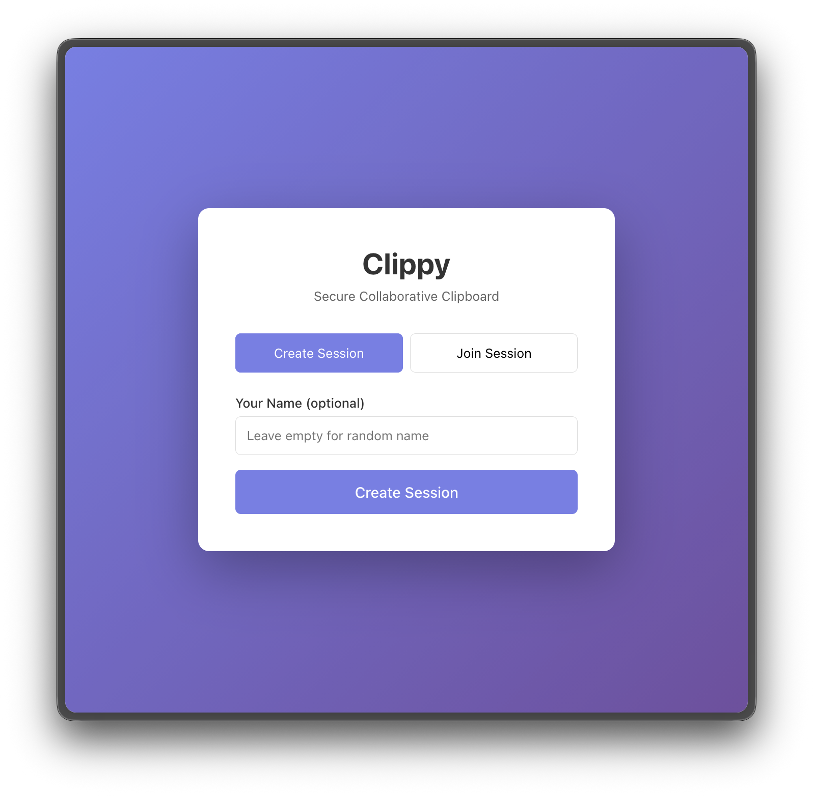
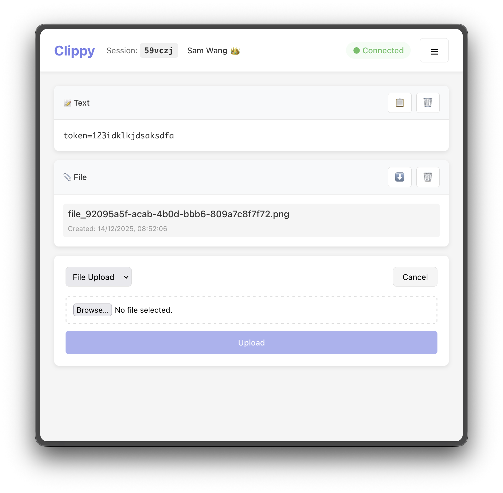
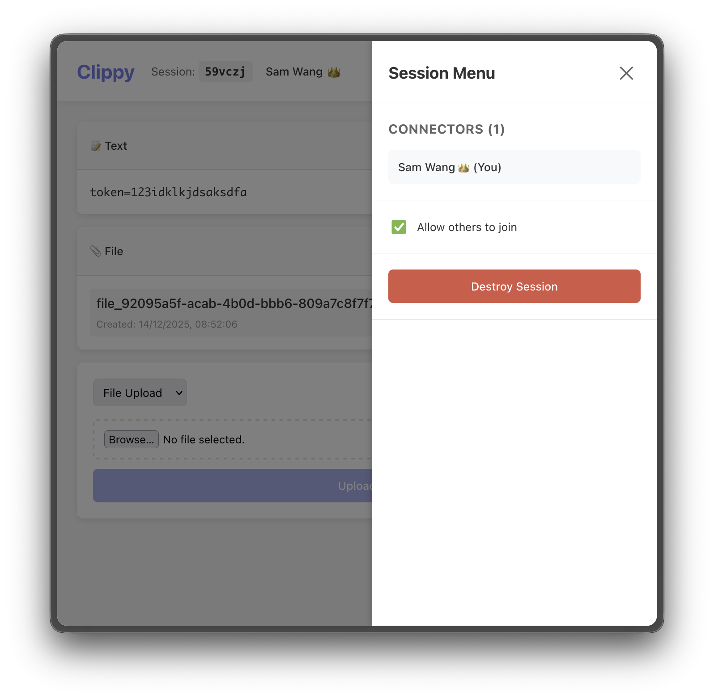

# Simple URL Shortener

一個讓使用者能透過安全、加密的連線階段 (Session)，即時分享文字與檔案的網頁應用程式。


[Link for English version](README.md)

---

## 目錄 📖

- [特點 ✨](#特點-)
- [截圖 📸](#截圖-)
- [用法 🚀](#用法-)
    - [安裝 ⚙️](#安裝-)
    - [設定速率限制 🕒](#設定速率限制-)
    - [修改預設連接埠 🔌](#修改預設連接埠-)
- [自己建構 🛠](#自己建構-)
    - [檔案結構 🗄](#檔案結構-)
    - [原始碼 ✅](#原始碼-)
    - [建構 🚧](#建構-)
- [鳴謝 🙏](#鳴謝-)
- [備註 📝](#備註-)
    - [已知的bug 🐛](#已知的bug-)
- [問題 / Bugs? 🙋‍♀️](#問題--bugs-)
---

## 特點 ✨

厭倦了在不同電腦間傳輸文字或檔案嗎？試試這個剪貼工具！

- **基於連線階段 (Session) 的分享**：使用簡單的 6 碼 ID 建立或加入連線。
- **端對端加密**：所有文字與檔案在傳輸前皆會在用戶端進行加密。
- **即時協作**：當其他使用者建立區塊時，您能立即看到它們出現。
- **檔案上傳**：支援最大 1 GiB 的檔案上傳（可設定）。
- **使用者管理**：
    - 自訂或隨機使用者名稱
    - 主持人 (Host) 可轉移權限給其他使用者
    - 主持人可控制是否允許新使用者加入
- **連線持久性**：連線將保持啟用，直到主持人銷毀或閒置 1 小時後自動結束。
- **區塊系統**：新增與刪除文字或檔案區塊，操作方式類似 Jupyter notebooks。
---

## 截圖 📸





---

## 用法 🚀

### 安裝 ⚙️

1. 從 Release 頁面下載 ZIP 壓縮檔。若要自行建構，請參考 [自己建構](#自己建構-)。
2. 解壓縮檔案。
3. 執行安裝腳本：
   ```bash
   bash setup.sh

   # 如果 Docker 需要 root 權限
   sudo bash setup.sh
   ```
4. 按照提示輸入變數與參數。
5. 大功告成！

### 設定速率限制 🕒

速率限制設定在 nginx。預設允許每分鐘 10 次請求。可以在 `docker/nginx/nginx.conf` 中修改限制。

### 修改預設連接埠 🔌

網頁預設執行在連結埠 8080。如要更改，請編輯位於專案根目錄的 `.env` 檔案。

---

## 自己建構 🛠

### 檔案結構 🗄

#### 原始碼 🧑‍💻

- **前端:** 使用Vite，在 `frontend` 資料夾中。
- **後端:** 使用Python的FastAPI，在 `backend` 資料夾中。

#### Docker 🐳

- `docker/web`：包含建構完的前端檔案。
- `docker/backend`：包含Python所寫的後端檔案。
- `docker/nginx`：包含 Nginx `default.conf` 檔案。

### 事前準備 ✅

1. Node.js >= 22.20.0
2. Python >= 3.9.6

### 建構 🚧

#### 前端 🌐

1. 移至 `frontend` 資料夾.
2. 安裝依賴
   ```bash
   npm install
   ```
3. (可選) 更動程式碼。
4. (可選) Vite 開發時可使用以下指令執行：
   ```bash
   npm run dev
   ```
5. 建構前端：
   ```bash
   npm run build
   ```
6. 將 `dist` 資料夾底下的檔案複製到 `docker/frontend/`。

#### 後端 👨‍🔧

FastAPI 說明文件在 https://example.com/api/v1/docs。

Passphrase 和 salt 儲存於 docker/backend/.env 檔案中。

若您想修改後端，請依照以下步驟。否則，直接將 `backend/` 資料夾底下的的內容複製到 `docker/` 即可。

1. 移至 `backend` 資料夾。
2. (可選) 建立虛擬環境：
   ```bash
   python -m venv .venv
   ```
   OR 使用 uv
    ```bash
    uv venv
    ```
3. (如果沒有使用虛擬環境請跳過) 啟用虛擬環境：
   ```bash
    source .venv/bin/activate
    ```
4. 安裝依賴：
   ```bash
   pip install -r requirements.txt
   ```
   OR 使用 uv
    ```bash
   uv sync
    ```
5. 更改程式碼。
6. 在開發模式執行：
   ```bash
   python app.py
   ```
7. 將 `backend` 資料夾底下的檔案複製到 `docker/backend/`。

注意：開發時您可能需要將 python .env 中的 ALLOWED_ORIGINS 更改為 *。

---

## 備註 📝

### 已知的bug 🐛

- 銷毀連線階段後，可能無法直接導回首頁。

---

## 問題 / Bugs? 🙋‍♀️

遇到問題或 Bug 嗎？歡迎在 Issues 回報並提交 Pull Requests，但在開始寫 PR 之前，請先開啟一個 Issue 進行討論。