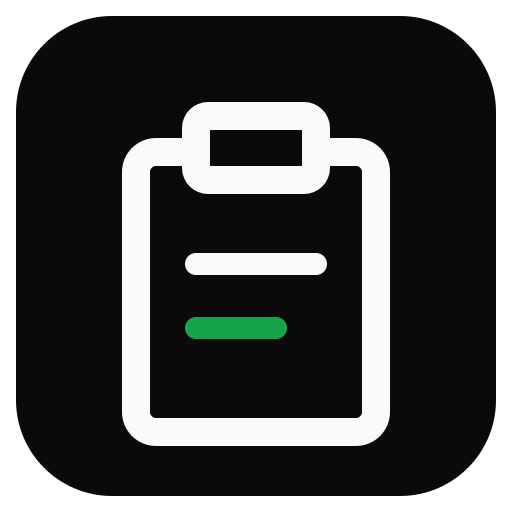
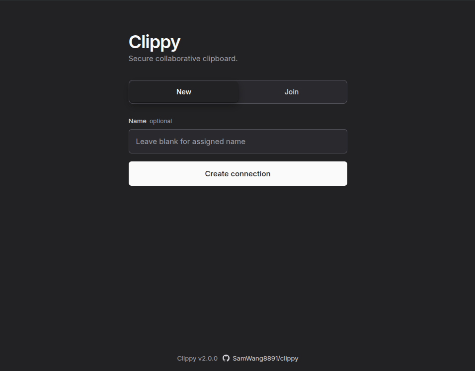
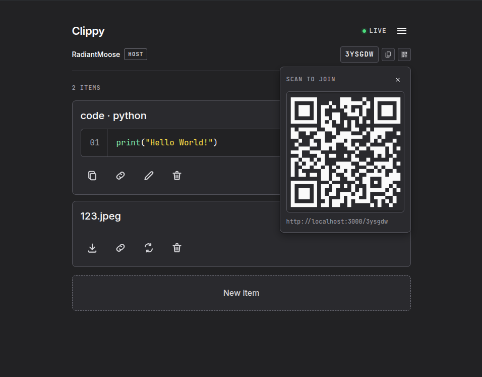
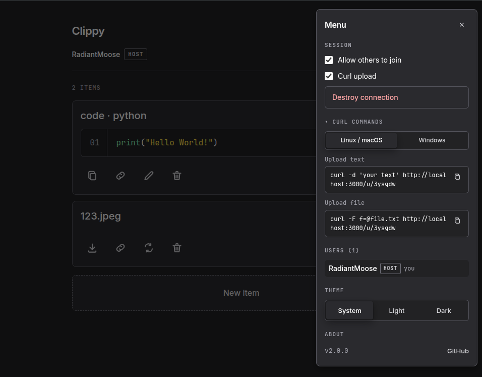

<div align="center">



# Clippy


一個讓使用者能透過安全、加密的的方式，即時分享文字與檔案的網頁應用程式。

[Link for English version](README.md)

</div>

---

## 目錄 📖

- [特點 ✨](#特點-)
- [截圖 📸](#截圖-)
- [用法 🚀](#用法-)
    - [安裝 ⚙️](#安裝-)
- [本地開發 🛠](#本地開發-)
    - [本地執行 🚧](#本地執行-)
    - [使用 Docker 建構 🐳](#使用-docker-建構-)
- [備註 📝](#備註-)
    - [已知的bug 🐛](#已知的bug-)
- [問題 / Bugs? 🙋‍♀️](#問題--bugs-)

---

## 特點 ✨

厭倦了在不同電腦間傳輸文字或檔案嗎？試試這個剪貼工具！

- **基於連線階段 (Session) 的分享**：使用克制化長度的 ID 建立/加入連線，可自行指定 ID 或交由伺服器產生。伺服器自動產生的 ID 不會出現 `i`、`o`、`e`、`0`、`1`，避免唸出來或用眼睛抄寫時認錯；自行指定則 `a-z0-9` 皆可使用。ID 欄位為密碼輸入框，讓作業系統在聚焦時自動切離中文輸入法，但輸入內容仍然可見。
- **公開 Clippy**：主持人可按下 QR Code 旁的鎖頭，把連線列在首頁上。首頁會顯示最新的 5 個公開連線，包含名稱、ID、建立時間與最後更新時間，並透過 WebSocket 即時顯示與隱藏。未經主持人解鎖前一律為私人連線。
- **加密傳輸**：每個連線階段使用一把由連線 ID 透過 SHA-256 衍生的 256 位元 AES-GCM 金鑰，所有文字與檔案在離開瀏覽器前皆會在用戶端加密；伺服器僅儲存密文（伺服器同時持有 ID，因此並非嚴格的端對端加密）。
- **即時協作**：當其他使用者建立區塊時，您能立即看到它們出現。
- **檔案上傳**：支援小檔案上傳。也可以直接把一個或多個檔案拖曳到連線頁面的任一處，不必先開啟新增區塊就會自動上傳。
- **圖片預覽**：上傳的圖片會在瀏覽器中解密並顯示縮圖。
- **Curl 上傳**：透過終端機上傳文字或檔案，主持人可針對每個連線啟用/停用此功能。
  ```bash
  curl -d 'hello' https://your-host/u/SESSION_ID
  curl -F f=@file.txt https://your-host/u/SESSION_ID
  ```
- **Raw 連結**：產生公開短連結，與任何人分享解密後的文字或檔案（例如 `https://your-host/r/SESSION_ID/CODE`）
- **使用者管理**：
    - 自訂或隨機使用者名稱，名稱會記錄在 local storage 中並於下次沿用
    - 主持人 (Host) 可轉移權限給其他使用者
    - 主持人可控制是否允許新使用者加入
- **連線持久性**：連線將保持啟用，直到主持人銷毀或閒置 1 小時後自動結束。連線過期或被銷毀時，頁面會直接返回首頁，不再停在警告視窗上。
- **區塊系統**：新增與刪除文字或檔案區塊，操作方式類似 Jupyter notebooks。

---

## 截圖 📸





---

## 用法 🚀

### 安裝 ⚙️

需要 Docker 和 Docker Compose。

```bash
mkdir clippy && cd clippy
curl -fsSL https://raw.githubusercontent.com/SamWang8891/clippy/main/docker-compose.prod.yaml -o docker-compose.prod.yaml
curl -fsSL https://raw.githubusercontent.com/SamWang8891/clippy/main/setup.sh -o setup.sh
bash setup.sh
```

腳本會引導你設定 URL、連接埠、上傳大小限制和連線 ID 長度，然後啟動服務。

若要從原始碼建構，請參考 [本地開發](#本地開發-)。

---

## 本地開發 🛠

### 事前準備 ✅

- Node >= 22.20.0
- Python >= 3.12

### 檔案結構 🗄

- **前端:** Vite + React，位於 `frontend/`。
- **後端:** Python FastAPI，位於 `backend/`。

### 本地執行 🚧

在兩個終端機分別執行前端和後端，支援即時重載：

```bash
# 終端機 1：後端
cd backend
cp .env.example .env
pip install -r requirements.txt  # 或：uv sync
python app.py

# 終端機 2：前端
cd frontend
npm install
npm run dev
```

Vite 開發伺服器會自動將 `/api`、`/ws` 和 `/r/` 代理到後端 `localhost:8123`。

FastAPI 說明文件位於 `http://localhost:8123/api/v2/docs`。

注意：開發時您可能需要在 `backend/.env` 中設定 `ALLOWED_ORIGINS=*`。

### 使用 Docker 建構 🐳

在本地建構並執行完整的 Docker 映像：

```bash
docker build -t clippy .
docker run -p 8080:80 --env-file backend/.env clippy
```

---

## 備註 📝

### 已知的bug 🐛

- 銷毀連線階段後，可能無法直接導回首頁。

---

## 問題 / Bugs? 🙋‍♀️

遇到問題或 Bug 嗎？歡迎在 Issues 回報並提交 Pull Requests，但在開始寫 PR 之前，請先開啟一個 Issue 進行討論。如要 PR，請設定目標為 dev 分支。